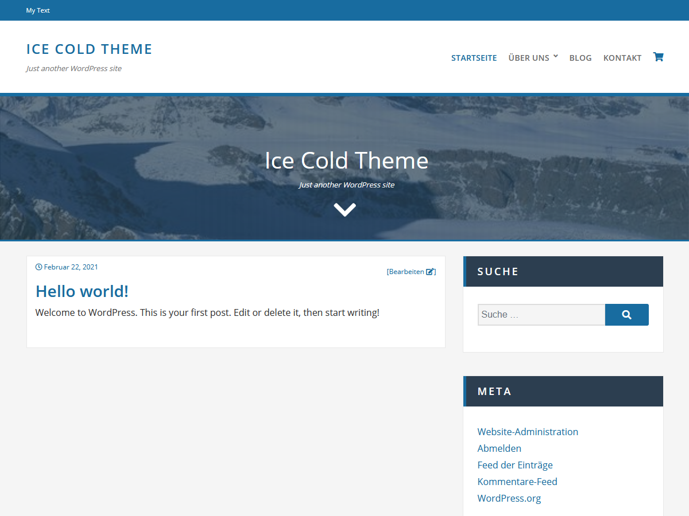

# Ice Cold

> :warning: This is a development version. Dont use this git clone repository for the production! Use the releases on the right side oder tab or use the wordpress theme place for the production.

<p align="center">
    
</p>


Theme:             | Ice Cold
-------------------|----------------
Contributors:      | [triopsi](https://profiles.wordpress.org/triopsi/)
Donate link:       | :heart: [PayPal Donate](https://www.paypal.me/triopsi) 
Version:           | [](https://github.com/triopsi/ice-cold/releases)
Requires at least: | 5.3
Tested up to:      | 5.6.1
Requires PHP:	   | 5.6
License:           | [](https://www.gnu.org/licenses/license-list.html#GPLv2)
License URI:       | https://www.gnu.org/licenses/license-list.html#GPLv2
Tags:              | one-column, two-columns, right-sidebar, flexible-header, custom-colors, custom-header, custom-background, featured-images, custom-menu, custom-logo, editor-style, footer-widgets, sticky-post, theme-options, threaded-comments, translation-ready, blog, portfolio, e-commerce
Status             | [](https://jenkins.cloudfoxi.de/job/Deploy-Ice-Cold-Theme/)
Checks              |[](https://make.wordpress.org/themes/handbook/review/required/) [](https://make.wordpress.org/themes/handbook/review/required/) [](https://make.wordpress.org/themes/handbook/review/required/) [](https://make.wordpress.org/themes/handbook/review/required/)
Size | []()
Last Update | []()


# Description

A simple WordPress Theme. This Theme are full responsive and are maked with the popular Bootstrap library. Flexible sidebars and footers. Perfect for a blog, portfolio or a frontpage. With parallax effects on frontpage.This theme support WooCommerce.

# Installation theme

## Manual installation

1. Download the ''ice-cold.zip'' archiwe from WordPress repository on the computer.
2. Unzip the archive
3. Then Upload the ''ice-cold'' folder to the /wp-content/themes/ directory
4. Activate the Theme through the ''Themes'' menu in WordPress
5. Navigate to Appearance > Customize in your admin panel and customize to taste.

## Installation using ''Add New Theme''

1. In your admin panel, go to Appearance > Themes and click the Add New button.
2. Type in Ice Cold in the search form and press the 'Enter' key on your keyboard.
3. Click on the 'Activate' button to use your new theme right away.
4. Navigate to Appearance > Customize in your admin panel and customize to taste.

# Installation development version
[](https://nodejs.org/en/)
[](https://www.npmjs.com/get-npm)
[](https://getcomposer.org/)


1. Git clone this project in your wordpress localy
2. Open a terminal, go to the project and update the composer ```composer install```
3. Update the npm package ```npm install```
4. Create a folder and file ```.vscode/settings.json```
```
{
    "phpcs.enable": true,
    "phpcs.executablePath": "./vendor/bin/phpcs",
    "phpcs.standard": "WordPress",
    "phpcbf.enable": true,
    "phpcbf.documentFormattingProvider": true,
    "phpcbf.onsave": true,
    "phpcbf.executablePath": "./vendor/bin/phpcbf",
    "phpcbf.standard": "WordPress",
    "files.eol": "\n"
}
```
5. Restart vscode


## Basic task with gulp
In this projetct you can use the follow gul task
```bash
# Minify Javascript (page-loader.js, smooth_scroll.js, to_the_top.js, navigation.js )
gulp minifyjs

# Minify CSS (site-style.css)
gulp minifycss

# Minify all js, all css
gulp all

# Minify all js, all css and start watch
gulp default

# Watch on Changse and minify that(site-style.css,Ftont and JS)
gulp watch

# Create a zip file of your project
gulp build

# ... more tast in the gulpfile
```

# Frequently Asked Questions

## Does this theme support any plugins?

* Supports Contact Form 7
* WooCommerce

# Credits

Developed by [Triopsi](https://wiki.profoxi.de)

# Contributions

Anyone is welcome to contribute to ice-cold theme.

There are various ways you can contribute:

1. Create an [Issue](https://github.com/triopsi/ice-cold/issues) on GitHub
2. Send a Pull Request with your bug fixes and/or new features
3. Provide feedback and suggestions on enhancements

# Changelog 

## 1.0.4

* Fix readme and style.css head
* Fix header.php pings

## 1.0.3

* Fix title on all pages 

## 1.0.2

* Add copyright licence in the readme.txt
* Fixed reamde.txt and style.css comments
* Fix esc attributs
* Fix least wordpress 5.0

## 1.0.1

* FIXED EscHtml for breadcrumb
* FIXED EscHtml for searchform

## 1.0

Initial release

# Upgrade Notice

Nothing yet.

# Donations

If you like the plugin, consider a donation to support further development. [Click here](https://www.paypal.me/triopsi)

# Copyright & License Notes

Ice Cold WordPress Theme, Copyright 2020 Triopsi
Ice Cold is distributed under the terms of the GNU GPL

This program is free software: you can redistribute it and/or modify
it under the terms of the GNU General Public License as published by
the Free Software Foundation, either version 2 of the License, or
(at your option) any later version.

This program is distributed in the hope that it will be useful,
but WITHOUT ANY WARRANTY; without even the implied warranty of
MERCHANTABILITY or FITNESS FOR A PARTICULAR PURPOSE. See the
GNU General Public License for more details.

## Resources
* Bootstrap
    * Bootstrap v4.6.0 (https://getbootstrap.com/)
    * Copyright 2011-2020 The Bootstrap Authors
    * Copyright 2011-2020 Twitter, Inc.
    * Licensed under MIT (https://github.com/twbs/bootstrap/blob/master/LICENSE)

* Font Awesome
    * Font Awesome Free 5.15.1 by @fontawesome - https://fontawesome.com
    * License - https://fontawesome.com/license/free (Icons: CC BY 4.0, Fonts: SIL OFL 1.1, Code: MIT License)
    * Font Awesome Icons — CC BY 4.0 License (see https://fontawesome.com/license/free)
    * Font Awesome Fonts — SIL OFL 1.1 License (see https://fontawesome.com/license/free)
    * Font Awesome Code — MIT License (see https://fontawesome.com/license/free)

* animate
    * animate.css - 4.1.1 - https://animate.style/
    * Licensed under the MIT license - http://opensource.org/licenses/MIT

* Bundled header images
    * License: CC0 1.0 Universal (CC0 1.0)
    * Default images from https://pickupimage.com

* Name: snow-winter.jpg
    * URL: https://pickupimage.com/download-photos/Fantastic-winter-landscape/2330479
    * License: CC0 1.0 Universal (CC0 1.0)

* Name: winter-road.jpg
    * URL: https://pickupimage.com/download-photos/Winter-Snow-Road-Central-Park-New-York/2321738
    * License: CC0 1.0 Universal (CC0 1.0)

* Name: road-snow.jpg
    * URL: https://pickupimage.com/download-photos/winter-trees-on-snow/2324165
    * License: CC0 1.0 Universal (CC0 1.0)

* Name: train-snow.jpg
    * URL: https://pickupimage.com/download-photos/Snow-covered-train-station-in-Watlington-railway-station/2329145
    * License: CC0 1.0 Universal (CC0 1.0)

* Name: computer-office.jpg
    * URL: https://pickupimage.com/download-photos/Black-framed-upside-down-glasses-on-the-computer-keyboard/2338711
    * License: CC0 1.0 Universal (CC0 1.0)

* Name: fog-landscape.jpg
    * URL: https://pickupimage.com/download-photos/Tundra-Wilderness-Alaska/2324539
    * License: CC0 1.0 Universal (CC0 1.0)

* Name: loader-blue.gif
  * self-made picture by @triopsi
  * License: CC0 1.0 Universal (CC0 1.0)

* Name: grid-mask.png
  * self-made picture by @triopsi
  * License: CC0 1.0 Universal (CC0 1.0)